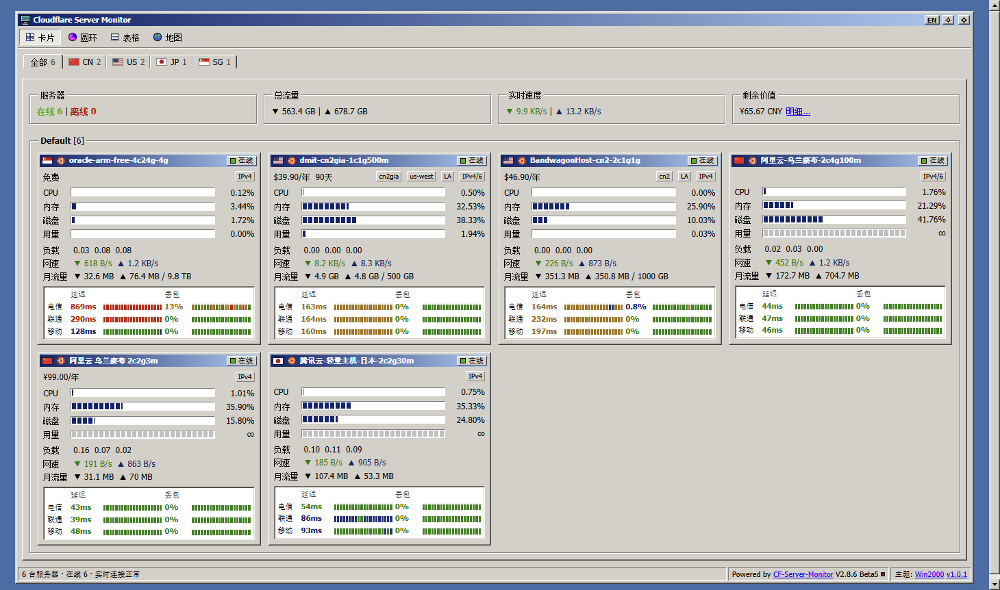

# CF-Server-Monitor Theme · Win2000

一款 Windows 2000 经典风格的 [CF-Server-Monitor](https://github.com/huilang-me/CF-Server-Monitor) 第三方主题。

整个页面就是桌面上的一个窗口：灰色立体控件、蓝色渐变标题栏、分段进度条、黑底绿网格的任务管理器风格图表。功能与默认主题一一对应，只换外观。



## 功能

- **首页**：卡片 / 圆环 / 表格 / 地图四种视图，地区选项卡筛选（放不下时收进「更多」），按分组显示，全局统计，剩余价值与汇率。
- **详情页**：主机信息，以及 CPU、内存、网络、负载、硬盘、磁盘 IO、GPU、进程、连接数、延迟、丢包图表，历史范围从 10 分钟到 7 天。
- **实时数据**：WebSocket 订阅（首页按后端分组订阅，详情页只订阅单台）；页面隐藏时断开、重新可见时先补 REST 数据再恢复；支持 `frontend_ws_timeout_minutes` 超时询问。
- **多后端**：支持 `apiBase` 配置多个 Worker。
- **登录与验证**：支持非公开站点（JWT）与 Turnstile 人机验证。登录入口统一跳转 `/admin#admin`。
- **外观**：经典浅色 + 深色两套配色，跟随后台 `preferred_theme`，也可以在标题栏切换；中英文跟随 `default_language`。
- **错误提示**：加载失败、跨域被拦截、需要登录时，都会弹出对话框说明原因，不会静默跳转。

## 安装

在 CF-Server-Monitor 后台的主题设置中填入主题地址。有三种写法：

| 用途 | 地址 |
| --- | --- |
| 始终使用最新发布版 | `https://github.com/finch-xu/CF-Server-Monitor-theme-win2000/tree/build` |
| 固定某个版本 | `https://github.com/finch-xu/CF-Server-Monitor-theme-win2000/tree/dist-v1.0.0` |
| 固定某个 commit | `https://github.com/finch-xu/CF-Server-Monitor-theme-win2000/tree/<build 分支上的 commit id>` |

每个 [Release](https://github.com/finch-xu/CF-Server-Monitor-theme-win2000/releases) 的说明末尾都列出了该版本对应的地址。也可以在后台的主题商店里直接选择版本，效果与固定 commit 相同。

## 开发

```bash
npm install
cp .env.example .env   # 设置 VITE_DEV_PROXY_TARGET 为你的 Worker 地址
npm run dev
```

本地开发时，需要在 Worker 的 `CORS_ALLOWED_ORIGINS` 中加入本地地址。

### 构建

```bash
npm run build
```

产物位于 `dist/`，只包含 `index.html` 和 `assets/`。推送到 `main` 只会检查能否构建成功，不会影响用户正在使用的主题。

### 发布新版本

1. 开发完成后推送到 `main`。
2. 在 GitHub 上进入 Releases → Draft a new release，新建标签（例如 `v1.1.0`），填写标题和更新说明后发布。
3. 大约一分钟后，GitHub Actions 会完成以下操作：
   - 构建该版本，在 `build` 分支上追加一个 commit，commit 标题为 `v1.1.0 <Release 标题>`（主题商店会把它显示为版本名）；
   - 给这个 commit 打上 `dist-v1.1.0` 标签；
   - 把构建产物 `theme-v1.1.0.zip` 附到 Release 上，并在 Release 说明末尾追加主题地址。

`build` 分支会保留每个版本的历史，不会被覆盖。如果某次发布失败，可以在 Actions 里手动运行 **Release theme**，填入标签重新发布。标签只能包含字母、数字、`.`、`_`、`-`。

### 纯静态部署（GitHub Pages 等）

在 `.env` 中设置 `API_BASE`（多个后端用英文逗号分隔），可选 `TITLE`、`BACKGROUND_IMAGE`、`BACKGROUND_IMAGE_MOBILE`，然后运行：

```bash
npm run build:github-page
```

每个后端 Worker 都要在 `CORS_ALLOWED_ORIGINS` 中加入主题所在的域名。

## 设计说明

见 [docs/DESIGN.md](docs/DESIGN.md)。

## 致谢与许可

- 数据层、实时推送、计费与国际化逻辑移植自 [CF-Server-Monitor](https://github.com/huilang-me/CF-Server-Monitor) 默认主题（MIT License）。
- 地图数据 `src/assets/world.zh.json` 来自 CF-Server-Monitor 仓库。
- 本主题的风格灵感来自 Windows 2000 经典界面。所有图标均为原创绘制，未使用 Microsoft 的图片、字体或声音素材；本项目与 Microsoft 无关。
- 本项目使用 [MIT License](LICENSE)。
